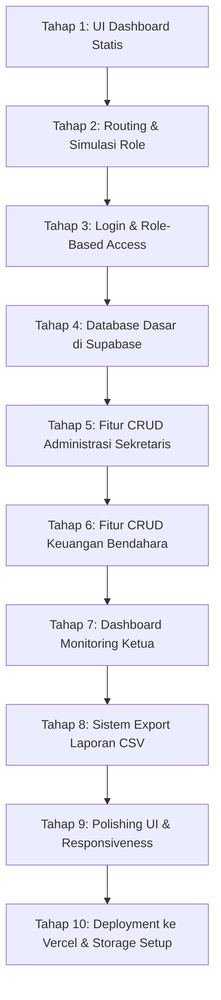

# Product Requirement Document (PRD)
## Pilar Digital Office v1.0 — Dashboard Pengurus Inti

---

### 1. Informasi Dokumen
* **Nama Produk:** Pilar Digital Office
* **Versi:** 1.0 (Dashboard Pengurus Inti)
* **Status:** Disetujui / Implementasi
* **Target Pengguna:** Pengurus Inti UKM Pilar Bangsa (Ketua, Sekretaris, Bendahara)
* **Teknologi Utama:** Next.js (App Router), Tailwind CSS, Supabase, Lucide React, Recharts

---

### 2. Deskripsi Produk
**Pilar Digital Office** adalah aplikasi web dashboard internal yang dirancang khusus untuk memfasilitasi pengurus inti UKM Pilar Bangsa dalam mengelola administrasi organisasi, program kerja, agenda, surat-menyurat, presensi, arsip dokumen, dan keuangan secara digital. 

Sistem ini berfokus pada integrasi data, transparansi operasional, efisiensi biaya, serta pengurangan ketergantungan pada pencatatan manual atau koordinasi yang tidak terstruktur melalui aplikasi pesan instan (seperti WhatsApp). Aplikasi ini dirancang dengan pendekatan *Role-Based Access Control* (RBAC) yang membagi fungsionalitas utama ke dalam tiga peran/jabatan struktural utama.

---

### 3. Masalah & Tujuan Produk
#### 3.1 Pernyataan Masalah
1. **Administrasi Terfragmentasi:** Pencatatan data anggota, surat-menyurat, dan notulensi rapat masih tersebar di berbagai platform dan file lokal pengurus, meningkatkan risiko kehilangan data.
2. **Ketergantungan WhatsApp:** Sebagian besar file operasional dikirim dan disimpan melalui grup WhatsApp, yang menyulitkan pencarian arsip lama.
3. **Kurangnya Transparansi Keuangan:** Pencatatan kas, iuran, dan transaksi masih bersifat manual, sehingga Ketua sulit memantau kondisi keuangan secara real-time.
4. **Monitoring Program Kerja Manual:** Ketua harus menanyakan status program kerja satu per satu secara langsung kepada penanggung jawab, alih-alih melihat perkembangan melalui satu pusat informasi.

#### 3.2 Tujuan Produk
1. **Modernisasi Tata Kelola:** Membangun ekosistem administrasi digital yang terpusat dan modern bagi UKM Pilar Bangsa.
2. **Pusat Monitoring Ketua:** Menyediakan dashboard komprehensif bagi Ketua untuk memantau program kerja, agenda terdekat, surat-menyurat, dan keuangan.
3. **Efisiensi Kerja Sekretaris:** Mempermudah pencatatan data anggota, sirkulasi surat, notulensi rapat, presensi, dan pengelolaan arsip.
4. **Akurasi & Transparansi Bendahara:** Menyediakan sistem pembukuan transaksi kas, pelacakan iuran anggota, serta unggahan bukti pembayaran yang transparan dan otomatis.

---

### 4. Target Pengguna & Role Persona
Aplikasi ini membatasi akses fitur secara ketat berdasarkan peran pengguna (Role-Based Access Control):

| Role | Deskripsi Persona | Fokus Utama di Aplikasi |
|---|---|---|
| **Ketua** | Pimpinan tertinggi organisasi yang memerlukan gambaran umum kondisi UKM untuk pengambilan keputusan strategis. | Monitoring program kerja, pembacaan grafik keuangan, peninjauan agenda, membaca rekap administrasi, dan menginput evaluasi program kerja. |
| **Sekretaris** | Pengelola administrasi dan dokumentasi organisasi. | Pengelolaan database anggota, surat masuk/keluar, penulisan notulensi rapat, pengelolaan daftar hadir (presensi), serta pengarsipan dokumen organisasi. |
| **Bendahara** | Pengelola keuangan dan kas organisasi. | Pencatatan transaksi pemasukan/pengeluaran, pengelolaan status iuran wajib anggota, rekapitulasi anggaran kegiatan, dan validasi bukti transaksi keuangan. |

---

### 5. Prinsip Desain & Palet Warna
Desain antarmuka mengikuti tren *Modern Executive Dashboard* (seperti *education management platform*) yang bersih, terstruktur, dan premium.

#### 5.1 Karakteristik Visual
* **Tata Letak:** Sidebar navigasi di sebelah kiri yang responsif, dikombinasikan dengan header atas yang berisi navigasi profil, notifikasi, pencarian, dan penanda role aktif.
* **Elemen UI:** Card dengan sudut membulat (*rounded-xl/2xl*), shadow halus (*drop-shadow-sm*), dan background abu-abu muda yang kontras untuk kenyamanan mata.
* **Grafik:** Penggunaan visualisasi grafik interaktif (Recharts) untuk menggambarkan tren keuangan dan perkembangan program kerja.

#### 5.2 Palet Warna (Color Palette)
Aplikasi ini menggunakan palet warna khusus untuk menjaga konsistensi visual:

```
Primary Purple    : █ #5B4B9A (Warna utama sidebar & tombol utama)
Secondary Purple  : █ #6C63B7 (Warna aksen interaktif & hover)
Background Gray   : █ #F4F5F7 (Latar belakang halaman)
Card White        : █ #FFFFFF (Latar belakang card & tabel)
Success Green     : █ #38C172 (Status aktif/lunas/selesai)
Warning Yellow    : █ #FFC107 (Status diproses/direncanakan/belum lunas)
Danger Red        : █ #F87171 (Status cuti/keluar/ditolak)
Text Dark         : █ #1F2937 (Warna teks utama)
Text Muted        : █ #6B7280 (Warna teks deskripsi & sekunder)
```

---

### 6. Hak Akses Matriks Fitur (RBAC)

Berikut adalah matriks otorisasi fitur untuk masing-masing role pengurus:

| Modul Fitur | Fungsi / Aksi | Ketua | Sekretaris | Bendahara |
| :--- | :--- | :---: | :---: | :---: |
| **Dashboard Utama** | Melihat ringkasan eksekutif (Statistik Global) | **Lihat** | **Lihat** | **Lihat** |
| **Data Anggota** | Tambah, Edit, Hapus data anggota | Lihat | **Kelola (CRUD)** | Lihat |
| **Program Kerja** | Tambah, Edit, Hapus program kerja | Lihat | Lihat | Lihat |
| **Evaluasi Kegiatan** | Tambah, Edit, Hapus catatan evaluasi | **Kelola (CRUD)** | Lihat | Lihat |
| **Agenda Kegiatan** | Kelola jadwal rapat / kegiatan | Lihat | **Kelola (CRUD)** | Lihat |
| **Surat-menyurat** | Kelola surat masuk dan surat keluar | Lihat | **Kelola (CRUD)** | - |
| **Notulensi Rapat** | Catat hasil rapat dan keputusan | Lihat | **Kelola (CRUD)** | - |
| **Presensi Anggota** | Input kehadiran berdasarkan agenda | Lihat | **Kelola (CRUD)** | - |
| **Keuangan / Kas** | Tambah, Edit, Hapus transaksi keuangan | Lihat | Lihat | **Kelola (CRUD)** |
| **Iuran Wajib** | Kelola pembayaran iuran bulanan anggota | Lihat | - | **Kelola (CRUD)** |
| **Arsip Dokumen** | Mengunggah dan merapikan arsip link/file | Lihat | **Kelola (CRUD)** | Lihat |
| **Ekspor Data** | Mengunduh laporan ke format CSV | **Aktif** | **Aktif** | **Aktif** |

---

### 7. Struktur Halaman (Routing Architecture)
Aplikasi dibangun menggunakan Next.js App Router dengan struktur folder routing sebagai berikut:

#### 7.1 Halaman Publik & Autentikasi
* `/` : Halaman Landing Page (Pengenalan UKM & Portal Dashboard).
* `/login` : Form masuk menggunakan Supabase Auth (Email & Password).
* `/unauthorized` : Halaman pembatas jika pengguna mencoba mengakses halaman di luar hak akses role-nya.

#### 7.2 Halaman Dashboard Ketua
* `/dashboard/ketua` : Ringkasan perkembangan program kerja, keuangan, dan agenda terbaru.
* `/dashboard/ketua/program` : Halaman monitoring detail program kerja divisi.
* `/dashboard/ketua/agenda` : Kalender dan daftar agenda mendatang.
* `/dashboard/ketua/evaluasi` : Input evaluasi kelemahan, kelebihan, dan rekomendasi program kerja.
* `/dashboard/ketua/laporan` : Halaman monitoring laporan keuangan gabungan.

#### 7.3 Halaman Dashboard Sekretaris
* `/dashboard/sekretaris` : Ringkasan jumlah anggota, surat masuk/keluar, dan status notulensi.
* `/dashboard/sekretaris/anggota` : Manajemen database anggota UKM.
* `/dashboard/sekretaris/surat` : Registrasi surat masuk dan pembuatan nomor surat keluar.
* `/dashboard/sekretaris/notulensi` : Pengisian berita acara rapat dan keputusan bersama.
* `/dashboard/sekretaris/presensi` : Input presensi kehadiran per agenda kegiatan.
* `/dashboard/sekretaris/arsip` : Unggah dokumen penting (proposal/LPJ) ke storage atau link Google Drive.

#### 7.4 Halaman Dashboard Bendahara
* `/dashboard/bendahara` : Ringkasan sisa kas aktif, grafik arus kas bulanan, dan tunggakan iuran.
* `/dashboard/bendahara/transaksi` : Pencatatan pemasukan dan pengeluaran.
* `/dashboard/bendahara/iuran` : Matriks status pembayaran iuran per anggota per bulan.
* `/dashboard/bendahara/laporan` : Laporan keuangan per program kerja/divisi.
* `/dashboard/bendahara/bukti-transaksi` : Daftar verifikasi bukti transfer pembayaran iuran atau nota belanja.

---

### 8. Arsitektur Database & Penyimpanan (Supabase)

Struktur tabel di bawah ini diimplementasikan pada database PostgreSQL Supabase dengan memanfaatkan Row Level Security (RLS) untuk menjamin keamanan data antar role.

#### 8.1 Schema Database (SQL DDL)

##### 1. Tabel `profiles` (Menyimpan data pengguna & role)
Menghubungkan tabel autentikasi Supabase (`auth.users`) dengan data profil internal.
```sql
CREATE TYPE public.user_role AS ENUM ('ketua', 'sekretaris', 'bendahara');

CREATE TABLE public.profiles (
  id UUID REFERENCES auth.users ON DELETE CASCADE NOT NULL PRIMARY KEY,
  full_name TEXT,
  email TEXT,
  role public.user_role NOT NULL DEFAULT 'ketua',
  avatar_url TEXT,
  created_at TIMESTAMP WITH TIME ZONE DEFAULT timezone('utc'::text, now()) NOT NULL
);
```

##### 2. Tabel `members` (Database Anggota UKM)
```sql
CREATE TABLE public.members (
  id UUID DEFAULT gen_random_uuid() PRIMARY KEY,
  name TEXT NOT NULL,
  nim TEXT UNIQUE,
  faculty TEXT,
  study_program TEXT,
  generation TEXT,
  phone TEXT,
  division TEXT,
  status TEXT DEFAULT 'Aktif', -- 'Aktif', 'Cuti', 'Alumni'
  created_at TIMESTAMP WITH TIME ZONE DEFAULT timezone('utc', now()) NOT NULL
);
```

##### 3. Tabel `programs` (Program Kerja Organisasi)
```sql
CREATE TABLE public.programs (
  id UUID DEFAULT gen_random_uuid() PRIMARY KEY,
  title TEXT NOT NULL,
  description TEXT,
  division TEXT,
  person_in_charge TEXT,
  status TEXT DEFAULT 'Berjalan', -- 'Direncanakan', 'Berjalan', 'Selesai', 'Dibatalkan'
  start_date DATE,
  end_date DATE,
  created_at TIMESTAMP WITH TIME ZONE DEFAULT timezone('utc', now()) NOT NULL
);
```

##### 4. Tabel `agendas` (Agenda dan Jadwal UKM)
```sql
CREATE TABLE public.agendas (
  id UUID DEFAULT gen_random_uuid() PRIMARY KEY,
  title TEXT NOT NULL,
  description TEXT,
  date DATE,
  time TIME,
  location TEXT,
  category TEXT, -- 'Rapat', 'Pelatihan', 'Kegiatan', 'Lainnya'
  created_at TIMESTAMP WITH TIME ZONE DEFAULT timezone('utc', now()) NOT NULL
);
```

##### 5. Tabel `letters` (Manajemen Surat Masuk/Keluar)
```sql
CREATE TABLE public.letters (
  id UUID DEFAULT gen_random_uuid() PRIMARY KEY,
  letter_number TEXT,
  letter_type TEXT NOT NULL, -- 'Masuk' atau 'Keluar'
  date DATE,
  sender TEXT,
  recipient TEXT,
  subject TEXT,
  file_url TEXT,
  status TEXT DEFAULT 'Diterima', -- 'Diterima', 'Diproses', 'Terkirim', 'Diarsipkan'
  created_at TIMESTAMP WITH TIME ZONE DEFAULT timezone('utc', now()) NOT NULL
);
```

##### 6. Tabel `minutes` (Notulensi Rapat)
```sql
CREATE TABLE public.minutes (
  id UUID DEFAULT gen_random_uuid() PRIMARY KEY,
  title TEXT NOT NULL,
  meeting_date DATE,
  participants TEXT,
  discussion TEXT,
  decisions TEXT,
  follow_up TEXT,
  file_url TEXT,
  created_at TIMESTAMP WITH TIME ZONE DEFAULT timezone('utc', now()) NOT NULL
);
```

##### 7. Tabel `attendance` (Presensi Kehadiran Anggota)
```sql
CREATE TABLE public.attendance (
  id UUID DEFAULT gen_random_uuid() PRIMARY KEY,
  agenda_id UUID REFERENCES public.agendas(id) ON DELETE SET NULL,
  member_id UUID REFERENCES public.members(id) ON DELETE SET NULL,
  status TEXT DEFAULT 'Hadir', -- 'Hadir', 'Izin', 'Sakit', 'Alfa'
  note TEXT,
  created_at TIMESTAMP WITH TIME ZONE DEFAULT timezone('utc', now()) NOT NULL
);
```

##### 8. Tabel `finance_transactions` (Pembukuan Kas Organisasi)
```sql
CREATE TABLE public.finance_transactions (
  id UUID DEFAULT gen_random_uuid() PRIMARY KEY,
  transaction_date DATE NOT NULL,
  type TEXT NOT NULL, -- 'Pemasukan' atau 'Pengeluaran'
  category TEXT,      -- 'Iuran', 'Sponsorship', 'Operasional', 'Kegiatan', 'Lainnya'
  amount BIGINT NOT NULL DEFAULT 0,
  description TEXT,
  responsible_person TEXT,
  proof_url TEXT,
  created_at TIMESTAMP WITH TIME ZONE DEFAULT timezone('utc', now()) NOT NULL
);
```

##### 9. Tabel `dues` (Pencatatan Iuran Anggota)
```sql
CREATE TABLE public.dues (
  id UUID DEFAULT gen_random_uuid() PRIMARY KEY,
  member_id UUID REFERENCES public.members(id) ON DELETE SET NULL,
  month INTEGER CHECK (month >= 1 AND month <= 12),
  year INTEGER,
  amount BIGINT NOT NULL DEFAULT 0,
  status TEXT DEFAULT 'Belum Lunas', -- 'Lunas', 'Belum Lunas', 'Diproses'
  payment_date DATE,
  proof_url TEXT,
  created_at TIMESTAMP WITH TIME ZONE DEFAULT timezone('utc', now()) NOT NULL
);
```

##### 10. Tabel `archives` (Arsip Dokumen UKM)
```sql
CREATE TABLE public.archives (
  id UUID DEFAULT gen_random_uuid() PRIMARY KEY,
  title TEXT NOT NULL,
  category TEXT,      -- 'Proposal', 'LPJ', 'SK', 'RAB', 'Dokumentasi', 'Lainnya'
  description TEXT,
  file_url TEXT,
  uploaded_by TEXT,
  created_at TIMESTAMP WITH TIME ZONE DEFAULT timezone('utc', now()) NOT NULL
);
```

##### 11. Tabel `evaluations` (Evaluasi Program Kerja)
```sql
CREATE TABLE public.evaluations (
  id UUID DEFAULT gen_random_uuid() PRIMARY KEY,
  program_id UUID REFERENCES public.programs(id) ON DELETE SET NULL,
  title TEXT NOT NULL,
  strengths TEXT,
  weaknesses TEXT,
  recommendations TEXT,
  created_at TIMESTAMP WITH TIME ZONE DEFAULT timezone('utc', now()) NOT NULL
);
```

#### 8.2 Arsitektur Penyimpanan File (Supabase Storage)
Untuk menampung dokumen fisik seperti PDF Surat, Bukti Transfer Keuangan, Proposal, LPJ, dan file gambar, dikonfigurasi bucket penyimpanan internal:
* **Nama Bucket:** `dokumen`
* **Status Bucket:** Publik (Akses baca publik menggunakan kebijakan `SELECT`)
* **Ukuran File Maksimal:** 50 MB
* **Allowed MIME Types:** `image/png`, `image/jpeg`, `application/pdf`, `application/msword`, `application/vnd.openxmlformats-officedocument.wordprocessingml.document` (DOCX).
* **Aturan Kebijakan (RLS Storage):**
  1. *Akses Baca:* Publik dapat mengunduh dokumen di bucket ini (`storage.objects` WHERE `bucket_id = 'dokumen'`).
  2. *Akses Tulis/Update/Hapus:* Dibatasi hanya untuk pengguna terautentikasi (`authenticated`).

---

### 9. Tahapan Pengembangan & Roadmap (Development Stages)

Pengembangan sistem dibagi menjadi 10 tahap berurutan untuk menjamin kualitas kode dan meminimalkan regresi fitur:



#### Rincian Setiap Tahapan:
* **Tahap 1 - UI Dashboard Statis:** Membuat layout dasar, sidebar ungu tua, header atas, dan visualisasi chart dummy untuk Ketua, Sekretaris, dan Bendahara.
* **Tahap 2 - Routing & Simulasi:** Konfigurasi rute halaman, tombol pemilih role sementara di login untuk mempermudah demonstrasi awal UI.
* **Tahap 3 - Login & Auth:** Implementasi Supabase Auth, middleware proteksi rute, dan penyimpanan role pengguna pada metadata Supabase.
* **Tahap 4 - Integrasi Database:** Eksekusi tabel-tabel utama (DDL SQL) di Supabase, migrasi data dummy ke server, serta penggantian data statis frontend dengan fetching API Supabase.
* **Tahap 5 - CRUD Sekretaris:** Pembuatan antarmuka form pengisian data anggota, surat, notulensi rapat, presensi, dan penyimpanan link arsip Google Drive.
* **Tahap 6 - CRUD Bendahara:** Pembuatan antarmuka pencatatan kas organisasi (tipe Pemasukan/Pengeluaran), form rekapitulasi iuran wajib, dan form unggah bukti transfer.
* **Tahap 7 - Dashboard Ketua:** Menghubungkan visualisasi data chart keuangan, statistik jumlah anggota, ringkasan surat, dan form input evaluasi kegiatan (terhubung ke tabel `evaluations`).
* **Tahap 8 - Laporan & Export:** Implementasi fungsionalitas unduh data tabular (Anggota, Surat, Presensi, dan Transaksi Keuangan) ke file format CSV/Excel.
* **Tahap 9 - Polishing & Responsiveness:** Optimasi performa loading state, skeleton loader, validasi form, error boundaries, dan responsive layout (mobile-friendly).
* **Tahap 10 - Deploy & Cloud Storage:** Deployment web application ke Vercel production, konfigurasi bucket `dokumen` di Supabase Storage untuk pengganti link Google Drive opsional, dan pengujian end-to-end (E2E) online.

---

### 10. Kriteria Non-Fungsional (Non-Functional Requirements)

1. **Keamanan & Autentikasi:**
   * Setiap password pengguna dienkripsi otomatis oleh Supabase Auth.
   * Hak akses dikunci menggunakan server-side middleware (Next.js) dan Row Level Security (RLS) di database PostgreSQL.
   * Kebijakan RLS membatasi modifikasi tabel data keuangan hanya untuk Bendahara, sedangkan Sekretaris untuk berkas administrasi.
2. **Ketersediaan & Kinerja:**
   * Aplikasi wajib dideploy di Vercel dengan edge network untuk meminimalkan latency.
   * Gambar dan aset digital dioptimalkan menggunakan Next.js `<Image />` component.
   * Query database dibatasi menggunakan pagination pada data tabular berukuran besar (misalnya histori transaksi kas dan data anggota).
3. **SEO & Metadata:**
   * Setiap halaman dashboard memiliki title tag dinamis (contoh: *Dashboard Ketua | Pilar Digital Office*) dan meta description deskriptif.
   * Struktur HTML menggunakan elemen semantik (`<header>`, `<nav>`, `<aside>`, `<main>`, `<footer>`).
   * Setiap elemen interaktif memiliki `id` unik untuk mempermudah automated testing di kemudian hari.

---

### 11. Batasan & Ruang Lingkup Luar (Non-Goals)
Untuk menjaga fokus penyelesaian versi MVP v1.0, beberapa fitur berikut disepakati untuk ditunda dan tidak dimasukkan ke dalam ruang lingkup pengerjaan saat ini:
1. **Real-time Chatting:** Komunikasi real-time antar pengurus tidak diintegrasikan langsung di aplikasi dashboard (tetap menggunakan WhatsApp).
2. **Notifikasi WhatsApp Otomatis:** Fitur pengiriman struk iuran atau pengingat agenda via WhatsApp API pihak ketiga.
3. **Absensi Berbasis Lokasi (QR Code/Geofencing):** Presensi dilakukan secara manual/checklist oleh Sekretaris, bukan mandiri oleh anggota melalui scan QR Code.
4. **Tanda Tangan Digital Terverifikasi:** Dokumen surat keluar diarsipkan dengan tanda tangan basah yang discan, bukan sistem tanda tangan digital kriptografi.
5. **Aplikasi Mobile Native (Android & iOS):** Dashboard diakses melalui web browser mobile secara responsif (tidak ada file .apk atau .ipa).

---

### 12. Kriteria Definisi Selesai (Definition of Done)
Versi awal (Pilar Digital Office v1.0) dinyatakan selesai dan siap dirilis jika memenuhi kriteria berikut:
1. **Akses Online:** Aplikasi berjalan tanpa error fatal di production URL Vercel.
2. **Fungsionalitas RBAC:** Pengguna dengan akun Ketua tidak dapat membuka dashboard Sekretaris/Bendahara (terarah ke `/unauthorized`), begitu pula sebaliknya.
3. **Integrasi Supabase:** Semua operasi Create, Read, Update, Delete (CRUD) pada modul utama berhasil menyimpan dan mengubah data asli di server Supabase.
4. **Visualisasi Data:** Dashboard Ketua dan Bendahara berhasil merender diagram Recharts secara akurat berdasarkan data transaksi di tabel `finance_transactions`.
5. **Manajemen Dokumen:** File surat atau bukti kas berhasil terunggah dan dapat diunduh kembali melalui media penyimpanan (Google Drive link / Supabase Storage).
6. **Ekspor Data:** Fitur pengunduhan data ke dalam file berekstensi `.csv` dapat dieksekusi dengan baik oleh semua pengurus inti.
